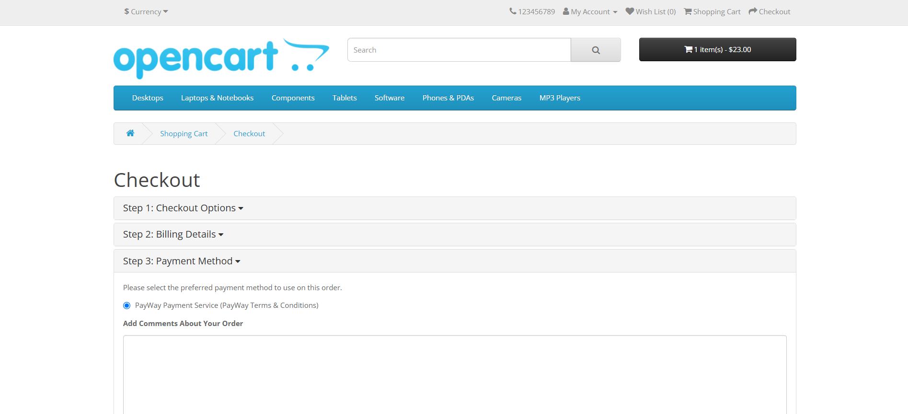

# PayWay

## Technical details

API: [PayWay Payment Gateway](https://www.payway.com.kh/developers/)

This Extension integrates ABA PayWay using the generic payment with redirection flow based on form
submission provided by the checkout/confirm page.

## Supported features
- Support OpenCart 3 
- Payment with redirection flow
- PayWay webhook status notification
- Verify transaction status from ABA against Webhook data
- Support Cards, ABA Pay, Bakong KHQR

## OpenCart Website Payment (Sandbox Mode)

## OpenCart PayWay Extension

## Setup process 
- Drag & drop the `admin` & `catalog` and `system` folder into their respective folders 
- Go to OpenCart dashboard 
- Navigate to Extensions > Extensions > Payments > `PayWay (ABA Bank)`
- Install, fill in your information and enable the payment setting  

## Module history

- `1.0`
  - Payment with redirection flow
  - PayWay Webhook integration 
  - Support Cards, ABA Pay, Bakong KHQR

## Future plans 

- `1.1`
  - Require suggestions from the community

## Testing instructions

**Card Type**: `Master Card`

**Card Number**: `5156 8399 3770 6226`

**EXP Date**: `01/2030`

**CVV2**: `923`

**3D Enrolled**: `No`